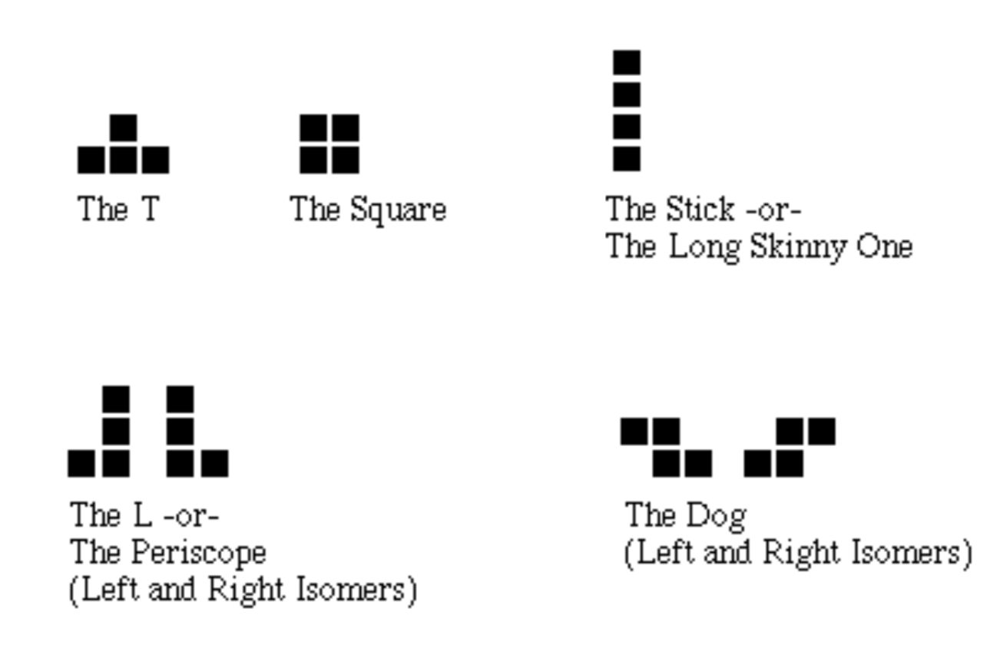
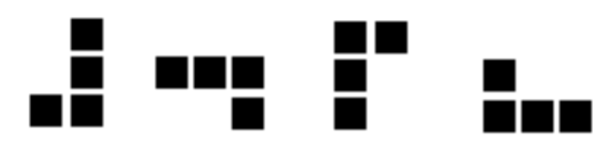
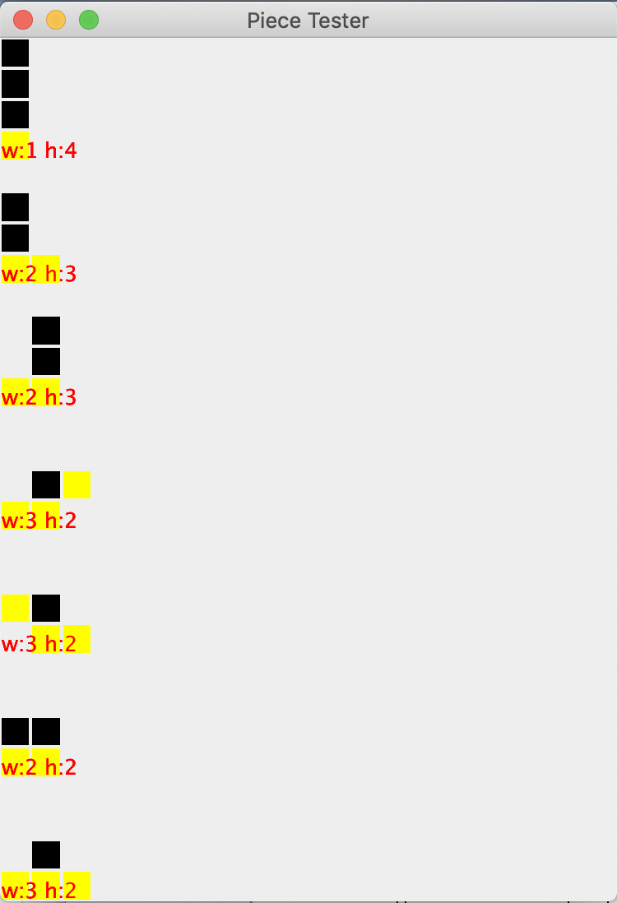
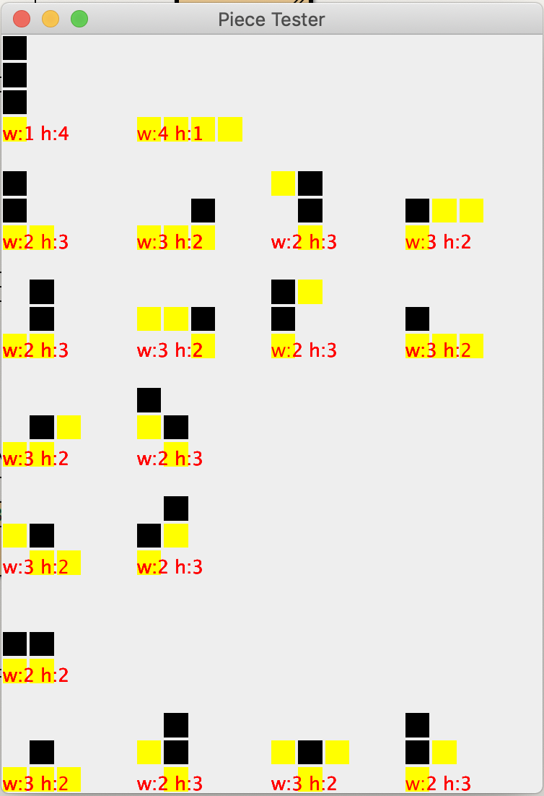
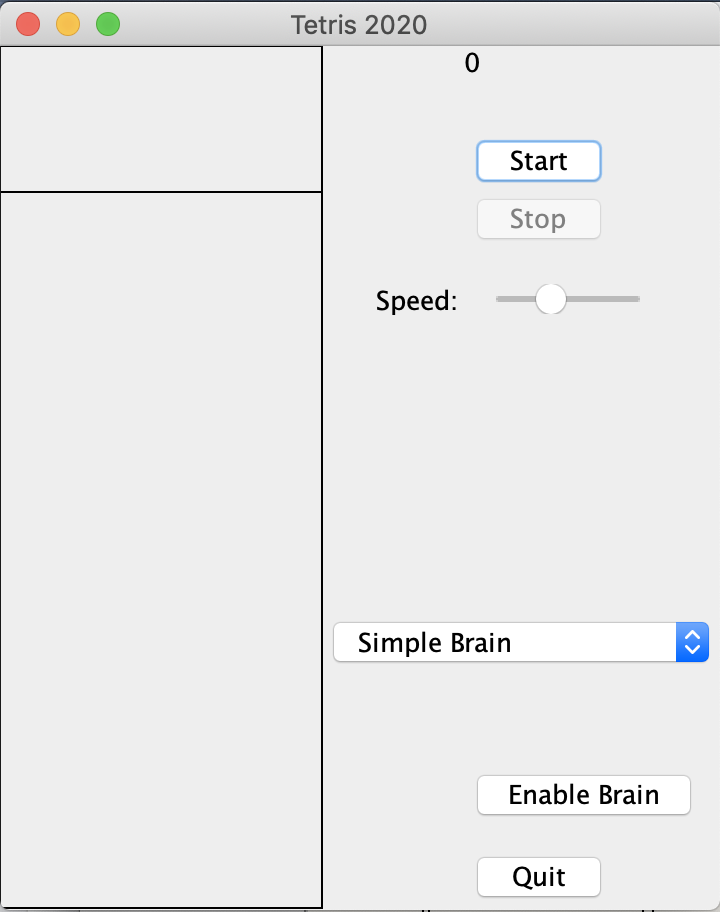
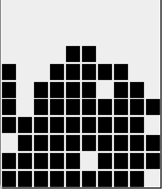

Tetris Lab

*Forked from "HW2 Tetris" from Stanford's CS108 by Nick Parlante*

In this lab, you will build up a set of classes for Tetris. This lab will emphasize elemental object-oriented design – using encapsulation to divide a big scary problem into many friendly little independently testable problems. The first part of the assignment sets up the Piece class. The second part builds the Board class and some other fun bits. For reasons that will become clear later, there is a theme of efficiency in this design. We are not just writing classes that implement Tetris. We are writing classes that implement Tetris **quickly**.

This lab is split into two parts. The first part focuses on the Piece class and is completed with your pair-programming partner. The second part focuses on the remaining classes and is completed on your own.

**You are required to commit to GitHub, at least daily, with a meaningful commit message describing what you accomplished and what needs to be done next.**

# Piece

There are seven pieces in standard Tetris.

Each standard piece is composed of four blocks. The two "L" and "dog" pieces are mirror images of each other, but we'll just think of them as similar but distinct pieces. A chemist might say that they where "isomers" or more accurately "enantiomers".

A piece can be rotated 90 ̊ counterclockwise to yield another piece. Enough rotations get you back to the original piece – for example rotating a dog twice brings you back to the original state. Essentially, each tetris piece belongs to a family of between one and four distinct rotations. The square has one, the dogs have two, and the L's have four. For example, here are the four rotations (going counter-clockwise) of the left hand L:

Our abstraction will be that a piece object represents a single Tetris piece in a single rotation, so the above diagram shows four different piece objects.

# Body

A piece is represented by the coordinates of its blocks which are known as the "body" of the piece. Each Piece has its own little coordinate system with its (0,0) origin in the lower left hand corner of the rectangle that encloses the body. The coordinates of blocks in the body are relative to the origin of the piece. So, the four points of the square piece are then:

(0,0)  <= the lower left-hand block

(0,1)  <= the upper left-hand block

(1,0)  <= the lower right-hand block

(1,1)  <= the upper right-hand block

Notice that not all pieces will actually have a block at (0,0). For example, the body of the following rotation of the right dog

has the body:

[(0,1),(0,2),(1,0),(1,1)]

A piece is completely defined by its body – all its other qualities, such as its height and width, can be computed from the body. The above right dog was a width of 2 and height of 3. Another quality which turns out to be useful for playing Tetris quickly is the "skirt" of a piece….

# Skirt

The skirt will be an int[] array, as long as the piece is wide, that stores the lowest y value for each x value in the piece coordinate system.

The skirt of this piece is {1, 0}. We assume that pieces do not have holes in them – for every *x* in the piece coordinate system, there is at least one block in the piece for that *x*.

# Rotations

The Piece class needs to provide a way for clients to access the various piece rotations. The client can ask each piece for a reference to the "next rotation" which yields a reference to a Piece object that represents the next rotation. This is the "immutable" paradigm – there is not a rotate() method that changes the object. Instead, the Piece objects are read-only, and the client can iterate over them (the String class is another example of the immutable paradigm).

For efficiency, we will pre-compute all the rotations just once. Given a Piece object, the client will be able to get a reference to the "next" Piece object which represents the next rotation. In essence, this allows the client to obtain each rotation in constant time.

# Rotation Strategy

The overall piece rotation strategy uses a single, static array with the "first" rotation for each of the 7 pieces. Each of the first pieces is the first node in a little circular linked list of the rotations of that piece. The client uses nextRotation() to iterate through all the rotations of a tetris piece. The array is allocated the first time the client calls getPieces() – this pattern is called "lazy evaluation" – build the thing only when it's actually used.

# Rotation Tactics

You will need to figure out an algorithm to do the actual rotation. Get a nice sharp pencil and scratch paper. Draw a piece and its rotation. Write out the coordinates of both bodies. Think about the transform that converts from a body to the rotated body. The transform uses reflections (flipping over) around various axes. Leverage your experience from the Collage Lab. The lower-left corner of the bounding box for the piece is always at {0, 0}.

# Generality

Our strategy uses a single Piece class to represent all the different pieces distinguished only by the different state in their body arrays. The code should be general enough to deal with body arrays of different sizes -- the constant "4" should not be used in any special way.

# * * *

# *TODO (pair programming):* Piece Constructor

The Piece.java starter file has several methods implemented and includes the method headers for the public methods you need to implement. Do not change the public method headers so your Piece will fit in with the later components. There are a few implementation hints at the top of the file. First, implement the Piece constructor as denoted by "TODO" comments.

# JPieceTest

The JPieceTest class is already implemented. You will invoke its main method to verify your Piece class. Each row in the window is an instance of JPieceTest. Each JPieceTest component takes a single piece, and draws all its rotations in a row. The code to set up the 7 JPieceComponents in a window is provided for you.

# *MILESTONE 1:* JPieceTest Initial Pieces

After completing the Piece constructor, you should be able to see that it's working correctly through JPieceTest. Do not continue until the window when you run the main method of JPieceTest looks exactly like the below one. Ask for help as needed.

# * * *

# *TODO (pair programming):* Piece's pieceRow method

Next, implement the pieceRow and toString methods. Tips for implementing the transformations are denoted by "TODO" comments.

# *MILESTONE 2:* JPieceTest with Rotations

You should be able to load and compute all the piece rotations and see that it's working correctly through JPieceTest. Do not continue until the window when you run the main method of JPieceTest looks exactly like the below one. In addition, the attributes of each piece will be printed to the terminal. Inspect these when debugging your code. Ask for help as needed.

# * * *

# The Pair Programming Potion of the Lab is Now Complete

# * * *

# Board

In the object-oriented system that makes up a tetris game, the Board class does most of the work. It is already implemented. It ...

* Stores the current state of a tetris board.

* Provides support for the common operations that a client "player" module needs to build a GUI version of the game: add pieces to the board, let pieces gradually fall downward, detect various conditions about the board.

* Performs all of the above quickly. Our board implementation will be structured to do common operations quickly. Speed will turn out to be important.

# Board Abstraction

The board represents the state of a tetris board. Its most obvious feature is the "grid" – a 2D array of booleans that stores which spots are filled. The lower left corner is (0,0) with X increasing to the right and Y increasing upwards. Filled spots are represented by a true value in the grid.

# JTetris

The provided JTetris class is a functional tetris player that uses your Piece and Board classes to do the work. Use the keys "4 5 6" to position and "0" to drop (j k l, n – are alternatives). The "speed" slider adjusts how fast it goes. You will create a subclass of JTetris that uses an AI brain to auto-play the pieces as they fall.

# TetrisViewer

Run the main method of the provided TetrisViewer class to play Tetris. If you correctly implemented the Piece class, the game should be fully functional.

# Understand JTetris

Read through JTetris.java a couple times to get a sense of how it works. You will be writing a subclass of it, so you need to see how it works. Key points in JTetris...

* tick() is the bottleneck for moving the current piece

* computeNewPosition() just encapsulates the switch logic to figure the new (x,y,rotation) that is one move away from the current one

* tick() detects that a piece has "landed" when it won't go down any more

* If the command line argument "test" is present, the boolean testMode is set to true. In that case, the game plays the same sequence of pieces every time, which can help with debugging.

As usual for inheritance, your subclass should add new behavior but use the existing behavior in the superclass as much as possible.

# This Is Your Brain

The Brain interface defines the bestMove() message that computes what it thinks is the best available move for a given piece and board. Brain is an interface although it could have been defined as a class.

# SimpleBrain

The provided SimpleBrain class is a simple implementation of the Brain interface. Glance at SimpleBrain.java to see how simple it is. Given a piece, it tries playing the different rotations of that piece in all the columns where it will fit. For each play, it uses a simple rateBoard() method to decide how good the resulting board is – blocks are bad, holes are bad. The Board class's dropHeight(), place(), and undo() methods are used by the brain to go through all the board combinations.

# *TODO (solo):* BrainFactory 

The BrainFactory class utilizes the factory design pattern to create a list of objects that implement the Brain interface. Implement the createBrains() static method to return an ArrayList containing references to a SimpleBrain object and a SmallBrain object. If you implement the extension to create other brains, add them to the list as well.

# *TODO (solo):* JBrainTetris createControlPanel method

Your first job will be to write a JBrainTetris subclass of JTetris that uses an AI brain to auto-play the pieces as they fall. We provide a simple brain for you, but you can work on your own if you wish.

You can copy ideas from JTetris source to build your JBrainTetris. Several instance variables in JTetris have a visibility of protected. Protected specifies that subclasses may directly access these instance variables. This isn't necessarily an ideal design. Here's what your JBrainTetris needs to do...

* Change JTetrisViewer.main() so it creates an instance of your JBrainTetris instead of JTetris.

* JBrainTetris needs to have an instance variable of type Brain. Its value should be the reference associated with the currently selected brain in the brain combo box control (refer to the next bullet).

* Override the createControlPanel() method.

    * Invoke the superclass's implementation first and then add additional components to the container that is returned.

    * Invoke the BrainFactory class's createBrains method. Use the returned list to create a JComboBox. You will need to create and add an object that implements the ActionListener interface to the JComboBox. The listener will need to update the reference stored in the brain instance variable to the selected value in the JComboBox. Add the JComboBox to the container. [This tutorial](https://docs.oracle.com/javase/tutorial/uiswing/components/combobox.html#uneditable) may be helpful.

    * Create a JButton labeled "Enable Brain". You will need to create and add an object that implements the ActionListener interface to the JButton. The listener will need to update an instance variable to reflect if the brain is enabled or not. It will also need to update the label of the button. Add the JButton to the container.

# *MILESTONE 3:* Verify the GUI

Run the main method of the provided TetrisViewer class. Verify that the graphical user interface matches the below image.

# * * *

# *TODO (solo):* JBrainTetris pickNextPiece and tick methods

Continue implementing your JBrainTetris class... 

* Override the pickNextPiece method to use the brain to compute, if the brain is enabled, where the brain says the piece selected by the superclass should go – the "goal". Overriding this method ensures for performance reasons that we only compute the goal a single time for each new piece.

* Override the tick() method, so that every time the system calls tick(DOWN) to move the piece down one, JBrainTetris takes the opportunity to move the piece a bit first (if the brain is enabled). The brain may do up to one rotation and one left/right move each time tick() is called: rotate the piece one rotation and move it left or right one position. The piece should drift down to its correct place. *Extension: You can add the "Animate Falling" checkbox to control if the brain is willing to use the "DROP" command to drop the piece down once it is lined up.* After the brain moves, the tick(DOWN) can go through as usual. As the board gets full, the brain may fail to get the piece over fast enough. That's ok. (We could have a mode where the brain just got to zap the piece into its correct position in one operation, but it's not as fun to watch.)

It can be sort of mesmerizing to watch the brain play; at least when it's playing well and the speed isn't too fast. Otherwise it can be sort of stressful to watch.

# *MILESTONE 4:* Watch the Brain Play Tetris

Run the main method of the provided TetrisViewer class. Verify that the following works as expected:

* the game can still be played manually

* enable the simple brain and start the game

* select the small brain and start the game

* enable brain while the game is running

* disable brain while the game is running

* change to small brain while the game is running

* change back to simple brain while the game is running

# * * *

# *MILESTONE 5:* Stress Test

Use test mode (use the arg "test" when invoking the main method of JTetrisViewer) to force JTetris to use the fixed sequence of 100 pieces. Test mode with the unchanged SimpleBrain and with the pieces array built in the standard order should lead to exactly the following board after the 100 pieces have been played…

This is an extremely rigorous test of the Board. Although there were only 100 different boards with a piece landed on screen, the brain explored thousands of boards that were never on screen. If the stress test is not coming out right, you should ook at the JPieceTest output to verify that the pieces are correct in every detail.

# * * *

# *Extension:* New Pieces

All the code that you have written is general; the fact that the standard Tetris pieces all have four blocks isn't hard-coded. Therefore, you can add additional pieces to the game that have more or less than four blocks. Modify the Piece's class getPieces static method.

# *Extension:* Adversary

For this extension you will implement an excellent example of modular code reuse.

* Modify the createControlPanel method to add a JLabel that says "Adversary:", a JSlider with the range 0..100 and initial value 0, and a status JLabel that says "ok" to the container.

* In the overridden pickNextPiece() method, create a random number between 1 and 99. If the random number is greater than the slider, then the piece should be chosen randomly as usual. But, if the random value is less, the mischief begins. In that case the "adversary" gets to pick the next piece. When the piece is chosen at random, set the status label to "ok", otherwise set it to "*ok*". (We don't want the feedback to be too obvious so the below "victim" test can work nicely.) If the slider is 0 (all the way left), the adversary should never intervene.

* The adversary can be implemented with a little JBrainTetris code that uses the brain to do the work. Loop through the pieces array. For each piece, ask the brain what it thinks the best move is. Remember the piece that yielded the move with the worst (largest) score. When you've figured out which is the worst piece — the piece for which the best possible move is bad, then that's the piece the player gets! "Oooh tough break, another dog. Gosh that's too bad. I'm sure the long skinny one will be along real soon."

* This is a great example of abstraction. The Brain interface looks so reasonable. Little does the brain realize the bizarre context where it will be used – just the way modular code is supposed to work. Also notice how vital the speed of Board is. There are about 25 rotations for each piece on a board, so the adversary needs to be able to evaluate 7*25=175 boards in the tiny pause after a piece has landed and the next piece is chosen "at random". That's why the place() / undo() system has to be so fast. Row clearing will be rare in all that, but we need to be able to race through the placements.

* It's absolutely vital that once you have the adversary working, you go test it on some innocent person. Leave the adversary set to around 40% or so, and leave the speed nice and slow. "Hey Bob, I understand you're pretty good at Tetris. Could you test this for me? It's still pretty slow, so I'm sure you'll have no problem with it."

* For ironic enjoyment, have the brain play the adversary.

# *Extension:* BigBrain

Implementing a better tetris brain is a fascinating algorithmic / AI problem. Create the BigBrain subclass of SimpleBrain and update the BrainFactory to provide it as an option. Here are some suggestions for building a better brain:

* Height is bad

* Holes are bad

* Stacking more blocks on top of holes is bad

* Holes that are horizontally adjacent to other holes are not quite as bad

* Holes that are vertically aligned with other holes are not quite as bad

* Tall 1-wide troughs are bad

* 1-wide troughs are not so bad if they are only 1 or 2 deep. Think about which pieces could fill a 2-deep trough – 1, 2, or 3 out of the 7 pieces depending on the two sides of the trough.

* Sometimes a piece can be slid under another piece that has already dropped in order to fill a hole.

* Concentrate on issues that are near the current top of the pile. Holes that are ten levels below the top edge are not as important as holes that are immediately below the top edge.

* In some places the SimpleBrain code always has some arbitrary constants like 1.54 and -0.76 in it that can only inefficiently be optimized by hand. To get the best possible brain, use a separate genetic algorithm to optimize the constants. This is another reason why the design here has such an emphasis on speed -- the genetic optimizer needs to be able to rip through millions of board positions.

# *Extension:* Add More Awesome

Show me what you did!

# * * *

# Submission

* Submit a link to your GitHub repository with this assignment.

https://docs.google.com/document/d/1aP522dA1PyvgHs21AMOt7NL3zHahZJf8zTk7kPxGgPg/edit#heading=h.dp6yvn3xbr02
